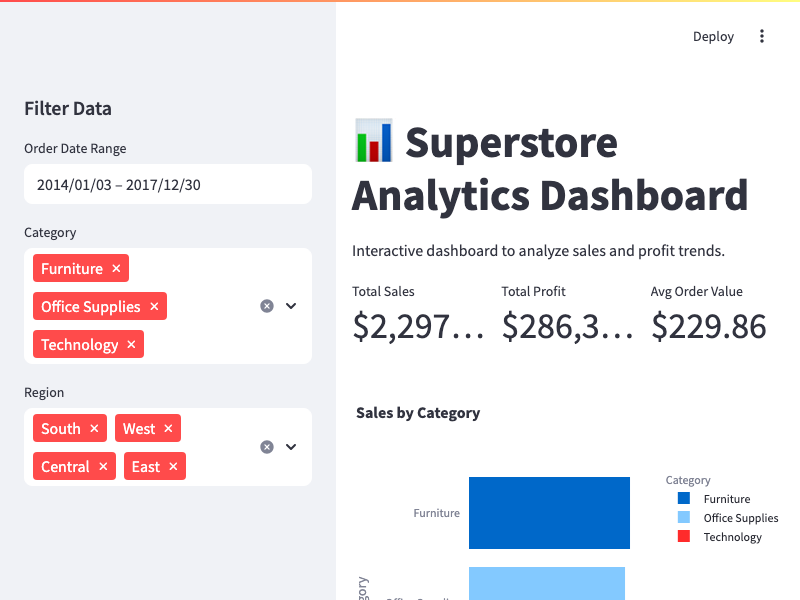
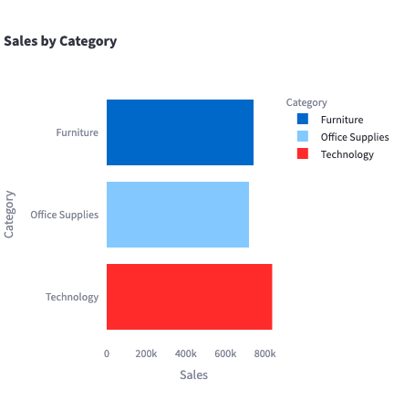
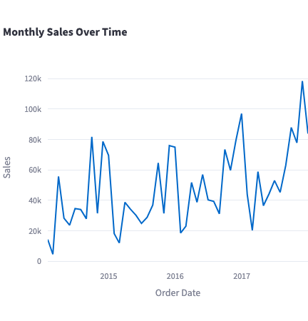

# 📊 Superstore Analytics Dashboard

An **interactive sales and profit dashboard** built using Python, Streamlit, and Plotly to analyze the **Sample Superstore** dataset.  
This project demonstrates **data exploration, KPI tracking, and business insights** for retail analytics.
[Streamlit Live Demo](https://superstoredashboard-4yphbux9wjbqtcfs8j5gnk.streamlit.app/)
---

## 🚀 Project Overview
This dashboard analyzes sales and profitability data from a fictional retail chain, *Sample Superstore*, to uncover:
- **Key performance indicators (KPIs)**: total sales, profit, and order volume
- **Sales and profit trends over time**
- **Category and sub-category performance**
- **Regional sales breakdowns**

The goal is to provide **stakeholders** with a clear, interactive view of business performance to support **data‑driven decision‑making**.

---

## 🛠 Tools & Technologies
- **Python**: Data processing & analytics
- **Pandas**: Data manipulation
- **Plotly**: Interactive charts
- **Streamlit**: Web dashboard framework
- **Matplotlib & Seaborn**: Data visualization
- **Jupyter Notebook** *(optional)*: Data exploration

---

## 📊 Example Dashboard View




---

## 📊 Exploratory Data Analysis (EDA) Results

This analysis explores the **Superstore dataset** to uncover trends in sales, profit, and category performance.

### **Key Insights**
- **Total Sales:** \$2,297,200.86  
- **Total Profit:** \$286,397.02  
- **Average Order Value:** \$229.86  
- **Top Sales Category:** Technology  
- **Most Profitable Category:** Office Supplies  
- **Highest Earning Region:** West

---

### **Visualizations**
#### **1. Sales by Category**


#### **2. Monthly Sales Over Time**


#### **3. Profit by Region**


---

### **Technical Notes**
- Dataset cleaned: removed extra spaces, parsed dates, ensured numeric types
- EDA performed using **Python, Pandas, Matplotlib, Seaborn**
- Charts exported as PNG for portfolio display

---

## 🛠 How It Works

This project follows a **three‑step workflow**:

### **1. Data Import & Setup**
```python
import pandas as pd
import matplotlib.pyplot as plt
import seaborn as sns
import os
```
- Pandas for data handling, Matplotlib/Seaborn for visualization
- os used for path handling and directory creation

### **2. Load & Inspect the Data**
```python
df = pd.read_csv(DATA_PATH)
print(df.shape, df.dtypes, df.isnull().sum())
```
- Reads CSV from data/ folder
- Prints dataset size, column types, and missing values for a quick health check

### **3. Calculate KPIs**
```python
total_sales = df['Sales'].sum()
total_profit = df['Profit'].sum()
avg_order_value = df['Sales'].mean()
```
- Computes Total Sales, Total Profit, and Average Order Value for quick business insights

### **4. Analyze by Category**
```python
category_sales = df.groupby('Category')['Sales'].sum()
```
- Groups data by Category to compare sales and profit performance

### **5. Visualize Insights**
```python
sns.barplot(x=category_sales.values, y=category_sales.index)
plt.savefig("screenshots/sales_by_category.png")
```
- Creates bar charts for visual storytelling
- Saves results in screenshots/ for portfolio use

### **6. Time Series Analysis**
```python
df['Order Date'] = pd.to_datetime(df['Order Date'])
sales_over_time = df.groupby(df['Order Date'].dt.to_period('M'))['Sales'].sum()
```
- Converts order dates into monthly periods for trend analysis

### **7. Regional Analysis**
```python
region_profit = df.groupby('Region')['Profit'].sum()

- Compares profitability across geographic regions
```

## 📊 Example Dashboard View

## ⚡ How to run locally
### 1. Clone the repository
git clone https://github.com/kcamacho1/superstore_dashboard.git

### 2. Navigate into the project folder
cd superstore_dashboard

### 3. Install dependencies
pip install -r requirements.txt

### 4. Run the Streamlit dashboard
streamlit run src/superstore_dashboard.py

---

### 📌 Features
- Filter sales data by date range and category
- Track KPIs with dynamic metrics
- View sales and profit trends over time
- Analyze category & regional performance
- Export filtered data for reporting

### 📈 Skills Demonstrated
- Data exploration & cleaning
- SQL-style querying in Pandas
- KPI calculation & business storytelling
- Interactive dashboard development
- Data visualization best practices

### Project Structure
```
superstore-analytics-dashboard/
│
├── data/
│   └── Superstore-dataset-clean.csv      # Clean dataset for analysis
│
├── notebooks/
│   └── superstore_data_exploration.ipynb # Optional Jupyter notebook for exploration
│
├── src/
│   ├── superstore_data_exploration.py    # EDA script
│   └── superstore_dashboard.py           # Streamlit dashboard script
│
├── screenshots/
│   ├── sales_by_category.png
│   ├── monthly_sales.png
│   ├── profit_by_region.png
│   └── dashboard_preview.png
│
├── README.md
├── requirements.txt
└── .gitignore
```