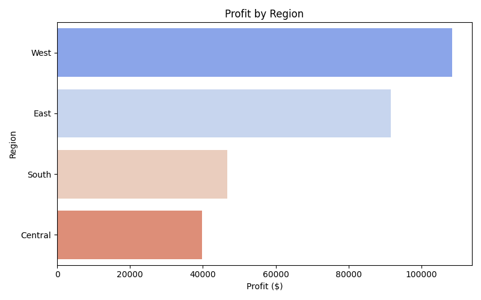

# 📊 Superstore Analytics Dashboard

An **interactive sales and profit dashboard** built using Python, Streamlit, and Plotly to analyze the **Sample Superstore** dataset.  
This project demonstrates **data exploration, KPI tracking, and business insights** for retail analytics.

---

## 🚀 Project Overview
This dashboard analyzes sales and profitability data from a fictional retail chain, *Sample Superstore*, to uncover:
- **Key performance indicators (KPIs)**: total sales, profit, and order volume
- **Sales and profit trends over time**
- **Category and sub-category performance**
- **Regional sales breakdowns**

The goal is to provide **stakeholders** with a clear, interactive view of business performance to support **data‑driven decision‑making**.

---

## 🛠 Tools & Technologies
- **Python**: Data processing & analytics
- **Pandas**: Data manipulation
- **Plotly**: Interactive charts
- **Streamlit**: Web dashboard framework
- **Jupyter Notebook** *(optional)*: Data exploration

---

## 📂 Project Structure
superstore-analytics-dashboard/
- data/
    - Superstore-dataset.csv        

- notebooks/
    - superstore_data_exploration.ipynb  

- src/
    - superstore_data_exploration.py  
    - superstore_dashboard.py         

- screenshots/
    - dashboard_preview.png
- README.md                       
- requirements.txt                    
- .gitignore                          

---
## 📊 Exploratory Data Analysis (EDA) Results

This analysis explores the **Superstore dataset** to uncover trends in sales, profit, and category performance.

### **Key Insights**
- **Total Sales:** \$2,297,200.86  
- **Total Profit:** \$286,397.02  
- **Average Order Value:** \$229.86  
- **Top Sales Category:** Technology  
- **Most Profitable Category:** Office Supplies  
- **Highest Earning Region:** West

---

### **Visualizations**
#### **1. Sales by Category**

#### **2. Monthly Sales Over Time**

#### **3. Profit by Region**

---

### **Technical Notes**
- Dataset cleaned: removed extra spaces, parsed dates, ensured numeric types
- EDA performed using **Python, Pandas, Matplotlib, Seaborn**
- Charts exported as PNG for portfolio display

---

## 📊 Example Dashboard View

---

## ⚡ How to Run Locally
1. Clone the repository:
    git clone https://github.com/yourusername/superstore-analytics-dashboard.git

2. Navigate into the project folder:
   cd superstore-analytics-dashboard

3. Install dependencies:
   pip install -r requirements.txt

4. Run the Streamlit dashboard:
   streamlit run src/superstore_dashboard.py

### 🌍 Live Demo
- 🔗 View Dashboard on Streamlit Cloud (Link will be active after deployment)

### 📌 Features
- Filter sales data by date range and category
- Track KPIs with dynamic metrics
- View sales and profit trends over time
- Analyze category & regional performance
- Export filtered data for reporting

### 📈 Skills Demonstrated
- Data exploration & cleaning
- SQL-style querying in Pandas
- KPI calculation & business storytelling
- Interactive dashboard development
- Data visualization best practices

### 📜 License
- This project is open source and available under the MIT License.
